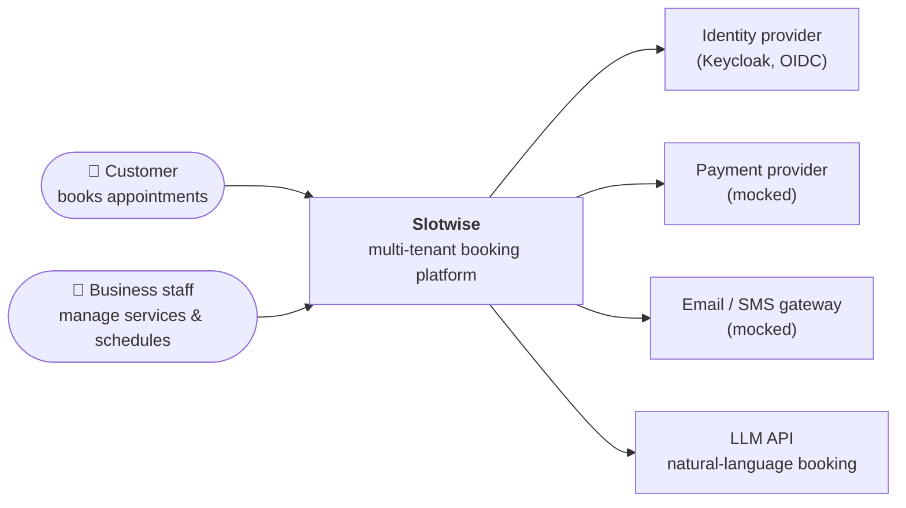
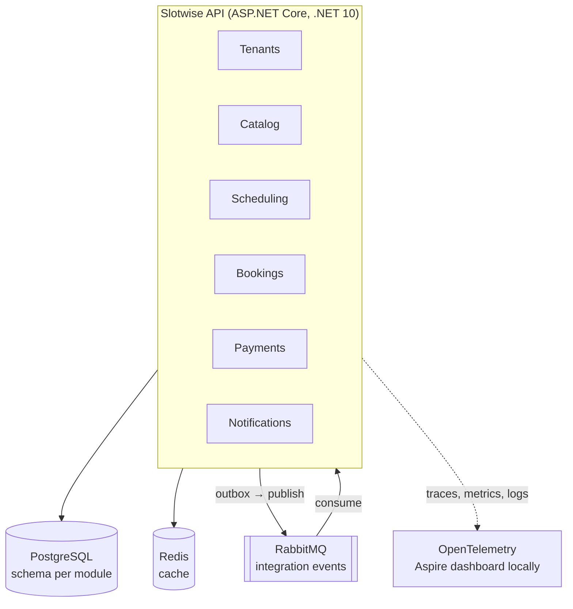

# Slotwise

[](https://github.com/piyushsngh401/slotwise/actions/workflows/ci.yml)


**Slotwise is a multi-tenant, event-driven booking platform for appointment-based businesses
such as clinics, salons and studios.** Each business (tenant) manages its services, staff and
availability, and customers book, reschedule and pay for appointments.

It's a portfolio project built the way a production system would be: in reviewed phases,
with architecture decisions recorded, quality gates in CI, and observability from day one.

> **Status:** Phase 1 (Foundation) in review. See the [roadmap](#roadmap).

## Why this project is interesting

Booking looks simple until you handle the hard parts, which are the focus here:

- **Multi-tenancy:** one deployment serves many businesses, with strict data isolation between them.
- **Concurrency:** two customers must never get the same slot, even under load.
- **Consistency across modules:** a booking, its payment and its notifications must agree,
  without distributed transactions (transactional outbox + message broker).
- **Operability:** every request is traceable across modules and infrastructure with OpenTelemetry.

## Architecture

Slotwise is a **modular monolith** ([ADR-0002](docs/adr/0002-modular-monolith.md)): one
deployable API made of modules that own their data and talk only through explicit contracts.
Module boundaries are enforced by architecture tests, so any module can later become its own service.

### System context



### Containers (target architecture)



Only the API host and platform plumbing exist today; each module arrives in its phase.

## Tech stack

| Concern         | Choice                                                    | Phase |
| --------------- | --------------------------------------------------------- | ----- |
| Runtime         | .NET 10, ASP.NET Core minimal APIs                        | 1     |
| Local dev       | .NET Aspire AppHost + dashboard                           | 1     |
| Observability   | OpenTelemetry (traces, metrics, logs), health checks      | 1     |
| API docs        | OpenAPI + Scalar                                          | 1     |
| Persistence     | PostgreSQL, EF Core                                       | 2     |
| Auth            | Keycloak, OpenID Connect, tenant- and role-based policies | 4     |
| Messaging       | RabbitMQ, transactional outbox                            | 5     |
| Caching         | Redis                                                     | 6     |
| AI              | LLM-powered natural-language booking (swappable provider) | 7     |
| Testing         | xUnit v3, Shouldly, Testcontainers, NetArchTest, k6       | 1–8   |
| Delivery        | GitHub Actions, containers, Kubernetes / Helm             | 1, 8  |

## Getting started

**Prerequisites:** [.NET 10 SDK](https://dotnet.microsoft.com/download). Docker is needed from Phase 2 onwards.

```bash
git clone https://github.com/piyushsngh401/slotwise.git
cd slotwise

# Run everything with the Aspire dashboard (logs, traces, metrics)
dotnet run --project src/Slotwise.AppHost

# Or run just the API; interactive docs at http://localhost:5180/scalar
dotnet run --project src/Slotwise.Api

# Build and test exactly as CI does
dotnet build
dotnet test
```

## Repository layout

```
src/
  Slotwise.AppHost/          Aspire orchestration for local development
  Slotwise.Api/              API host: composes modules, platform endpoints
  Slotwise.ServiceDefaults/  OpenTelemetry, health checks, resilience, service discovery
  Slotwise.SharedKernel/     IModule contract and module composition (kept deliberately small)
tests/
  Slotwise.Api.IntegrationTests/  In-memory host tests (WebApplicationFactory)
  Slotwise.ArchitectureTests/     Module boundary rules as executable tests
docs/adr/                    Architecture Decision Records
```

## Key design decisions

| ADR | Decision |
| --- | -------- |
| [0001](docs/adr/0001-record-architecture-decisions.md) | Record architecture decisions |
| [0002](docs/adr/0002-modular-monolith.md) | Start as a modular monolith, with boundaries enforced by tests |
| [0003](docs/adr/0003-aspire-for-local-orchestration.md) | Use .NET Aspire for local development only; deploy with Kubernetes |
| [0004](docs/adr/0004-build-quality-gates.md) | Warnings as errors, central package management, format checks in CI |
| [0005](docs/adr/0005-testing-strategy.md) | Layered testing with real infrastructure via Testcontainers |

## Roadmap

Each phase is one milestone and one reviewed pull request.

| Phase | Scope | Status |
| ----- | ----- | ------ |
| 1. Foundation | Solution structure, Aspire, CI, ADRs, module contract | 🔄 In review |
| 2. Core domain | Tenants, service catalog, staff availability; PostgreSQL; tenant isolation | ⏳ Planned |
| 3. Bookings | Booking flow, double-booking prevention, CQRS where it earns its place | ⏳ Planned |
| 4. Identity | Keycloak, OIDC, tenant- and role-based authorization | ⏳ Planned |
| 5. Events | RabbitMQ, transactional outbox, notifications, mocked payments | ⏳ Planned |
| 6. Performance | Redis caching, resilience policies, custom metrics | ⏳ Planned |
| 7. AI booking | Natural-language booking via an LLM behind a provider abstraction | ⏳ Planned |
| 8. Production readiness | Testcontainers suite, k6 load tests, Docker images, Kubernetes / Helm | ⏳ Planned |

Detailed issues live in the [milestones](https://github.com/piyushsngh401/slotwise/milestones).

## License

[MIT](LICENSE)
